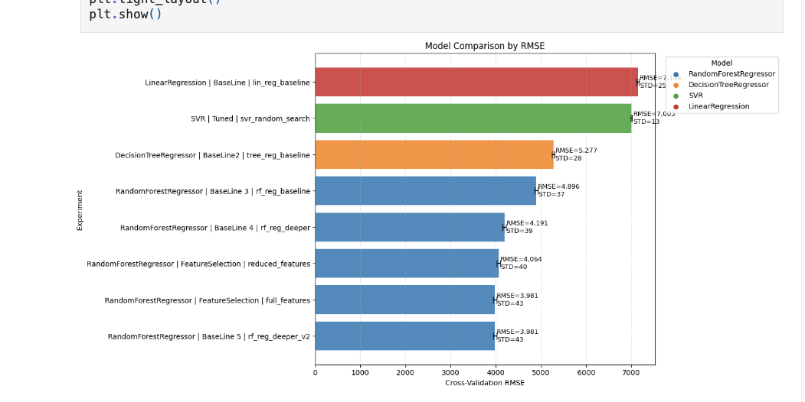
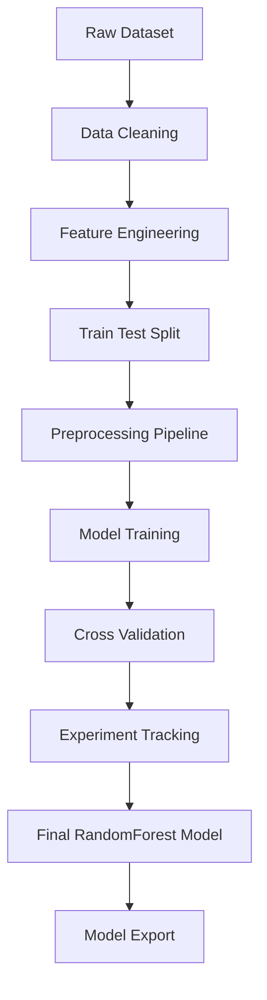
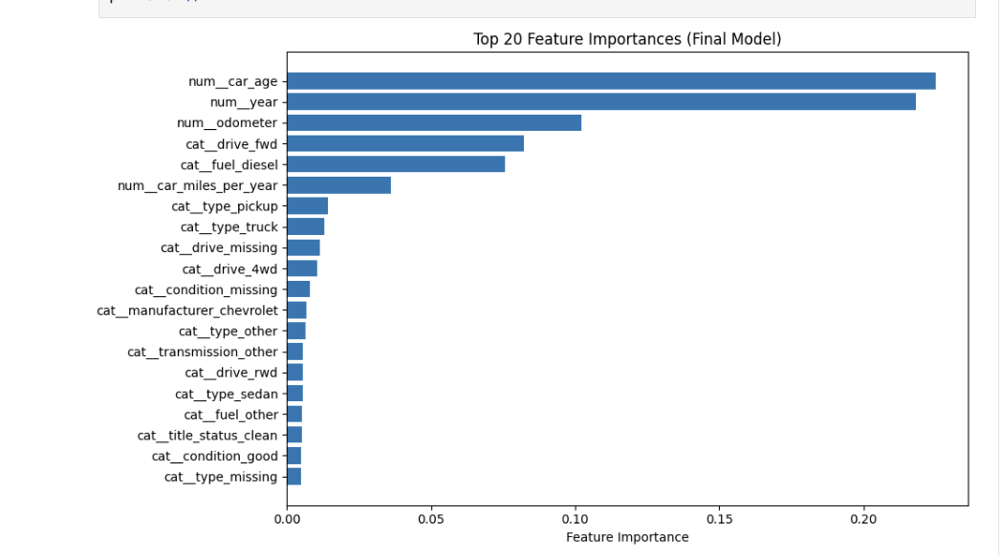

# **Used Car Price Prediction**

Machine learning system that estimates fair market prices for used vehicles based on structured listing data.

The project implements a complete ML workflow including data validation, feature engineering, preprocessing pipelines, model comparison, and experiment tracking.
## Model performance comparison
<p align="center">  </p>

***Experiments are tracked using a structured results table exported to CSV.***

## Key Features

- End-to-end machine learning pipeline
- Feature engineering and preprocessing pipelines
- Model comparison using cross-validation
- Experiment tracking via CSV logs
- Exportable trained model for inference

## Final results
| Experiment | Model | RMSE | MAE | MAPE |
|-----------|------|------|------|------|
| Baseline | LinearRegression | 7147 | 5234 | 0.51 |
| Tree | DecisionTree | 5276 | 2319 | 0.22 |
| RF baseline | RandomForest | 4896 | 3035 | 0.28 |
| RF deeper | RandomForest | 4191 | 2316 | 0.22 |
| RF feature selection | RandomForest | 3980 | 2043 | 0.20 |
| **Final model** | RandomForest | **3889** | **1891** | **0.197** |

RMSE represents the typical prediction error in USD, while MAPE indicates the percentage error relative to the vehicle price.

## Pipeline diagram



## Feature Importance
<p align="center">  </p>

Most important features influencing vehicle price prediction.

## Models Evaluated

The following regression models were evaluated:

- Linear Regression
- Decision Tree Regressor
- Random Forest Regressor
- Random Forest with GridSearch tuning
- Random Forest with RandomizedSearch tuning
- Support Vector Regressor

## Dataset

Dataset source: Craigslist Used Cars Dataset (Kaggle)

Detailed dataset information: `docs/data_sources.md`

**Number of rows and columns**

- Rows: 427,000
- Columns: 26

## How to Run

Clone the repository

```bash
git clone https://github.com/helen-sparrow-git/used-car-price-ml.git
cd used-car-price-ml
```

**Install the required packages:**
```bash
pip install -r requirements.txt
```
**Run the notebooks in order:**
1. `notebooks/01_data_validation.ipynb` 
2. `notebooks/02_model_training_pipeline.ipynb`

## Using the Trained Model

The final trained model is stored in:

`models/used_car_price_model.joblib`

Example prediction:

```python
import joblib
import pandas as pd

model = joblib.load("models/used_car_price_model.joblib")

car = pd.DataFrame({
    "year": [2017],
    "manufacturer": ["ford"],
    "model": ["wrx"],
    "odometer": [15000],
    "fuel": ["gas"],
    "transmission": ["manual"],
    "title_status": ["clean"],
    "drive": ["awd"],
    "type": ["sedan"],
    "condition": ["good"],
    "state": ["fl"],
    "paint_color": ["black"]
})

prediction = model.predict(car)

print(f"Estimated price: ${prediction[0]:,.0f}")
```

## Project Structure

```text
used-car-price-ml
│
├── README.md
├── LICENSE
├── requirements.txt
├── .gitignore
│
├── data
│   ├── raw
│   ├── processed
│   └── splits
│
├── docs
│   ├── data_sources.md
│   └── decisions.md
│
├── experiments
│   └── experiment_results.csv
│
├── images
│   ├── feature_importance.png
│   └── model_comparison.png
│
├── models
│   └── used_car_price_model.joblib
│
├── notebooks
│   ├── 01_data_validation.ipynb
│   └── 02_model_training_pipeline.ipynb
│
└── src
    ├── data
    ├── features
    │   └── build_features.py
    └── models
        ├── __init__.py
        ├── config.py
        ├── evaluation.py
        ├── experiment_tracking.py
        └── model_registry.py
```

## Repository Structure

- **data/** — raw, processed, and split datasets  
- **docs/** — project documentation and key decisions  
- **experiments/** — logged model results and experiment tracking  
- **images/** — plots used in the README  
- **models/** — saved trained model artifacts  
- **notebooks/** — step-by-step project workflow  
- **src/** — reusable project code for features, evaluation, and model setup

## Documentation

Additional project documentation:

- Business understanding — `docs/problem_definition.md`
- Data sources — `docs/data_sources.md`
- 